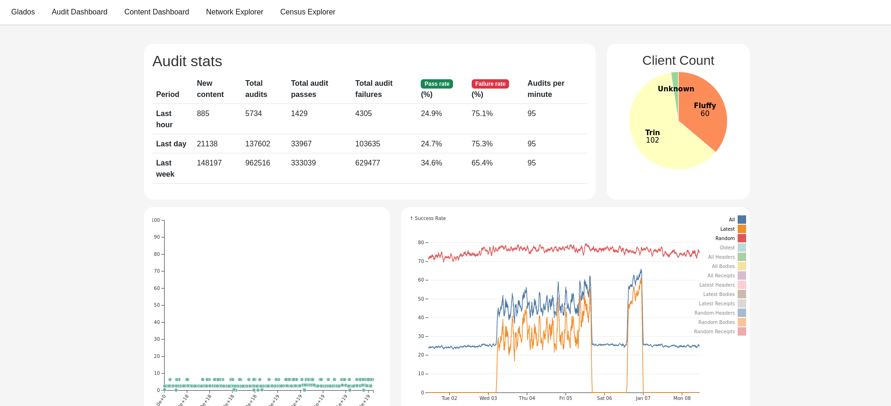

I am sitting here in my apartment in the first weeks of 2024 thinking about
this project that has consumed so much of me for so long. As often happens when
I try to tell stories about my work I cannot help but end up weaving in stories
about my life. I find some comfort in the balance I've found between my work
and my life and some joy that the two feel intertwined while largely avoiding
some of the more normative work/life balance pitfalls that seem common. I
suppose that it helps that my work has the rare property of checking [all of
the boxes](https://positivepsychology.com/ikigai/) where so often people have
to compromise.

But I digress...  So what actually happened in 2023...

* History network "works"
* Beacon network "works"
* Active monitoring of the network via Glados
* We have a [website](https://www.ethportal.net/)
* More people and teams join the project.
* Cross client testing via portal-hive
* Lots of subtle ways that the project has matured...

## History and Beacon networks "work"

This has got to be the most accessible accomplishement that we have to share.
While the term "works" needs a few asterisks in order to survive close
inspection, we have two of our three core networks running and live.

The history network is actively running and storing chain history, retaining
old history data and ingesting new history data as it is added to the chain.
Most of the clients now have functioning support for JSON-RPC endpoints like
`eth_getBlockByHash`. Additionally, the portal beacon network is also live,
with clients able to follow the beacon chain using data sourced from the portal
network DHT and the beacon light protocol data.  Both of these have provided us
with live networks with real data to battle test the design of our protocol
which has been largely theoretical until now.

## Monitoring via Glados

One of the other major additions to the project is
[Glados](https://glados.ethdevops.io/).  This project acts as a way to gain
insights into whether the portal networks are actually functioning.  At it's
core, Glados is an active monitoring tool which continually checks whether data
that *should* be available via actually is.  This tool has been instrumental in
the last year in measuring how well the networks and clients are performing,
diagnosing problems, and giving us in-depth visibility.

## A more respectable website (and a blog!)

[https://www.ethportal.net/](https://www.ethportal.net/)

With the help of some new additions to the project, we have a website. This
project has largely operated in an internal facing manner for the last few
years as we've been diligently building. During the course of 2023 it became
clear that we needed to shart shifting that focus a bit and do more outreach
work. Many people had incorrect or outdated information about what our project
was doing and where it was at in terms of delivering functionality.  The
addition of the website (and this blog) are steps we've been trying to take
towards being more outward facing and providing more up-to-date and accurate
information about our project.

## More people

While our three main client teams have remained largely the same size, we have
been excited to welcome new contributors and members to this project.  The EPF
has continued to be a source of new contributors, and we are excited at the
prospect of welcoming some of the execution layer client teams to the fold as
well.

## Four Fours (EIP-4444)

During DevConnect in Istanbul, we had conversations with most of the execution
layer teams, and were excited to tell them that we are ready for them to start
experimentation with use of Portal as a source for historical chain data.

## Portal Hive

Our teams have developed a forked version of "hive" which regularly runs a
growing suite of cross client tests to automatically check whether clients are
in complience with the specifications.

## Summing Things Up and Looking Ahead

As we head into 2024 we are proud of the work that has brought us to this point
where we have multiple implementations of our protocol running in a live
environment storing and serving the data we aim to provide. We are encouraged
by the attention we are starting to receive from the ecosystem which tells us
we are building something that people want to use.  And we are poised to
deliver the last piece of portal functionality, the state network, which will
complete the core of the data the portal network aims to serve.

It is incredible to look at how much has gone into getting us to this point,
and to look ahead and realize this is only the beginning.  With things like
Verkle and broader adoption and interest in stateless clients, we see the role
that Portal has to play only growing with time.
