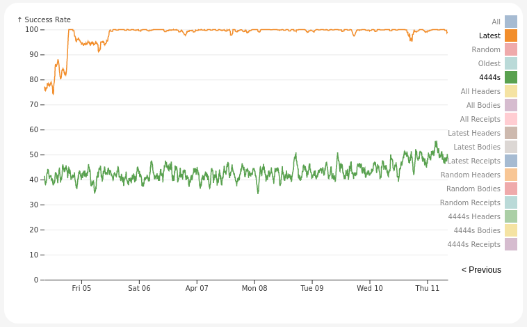

I am sitting here on the third and last day of our summit event in Prague.  The last two days have been full of deep discussions about the Portal protocol, pouring over our designs and plans.  Much of our time has been focused on the near term plans for finishing our MVP goals of delivering our three core networks that are slated to deliver unprecedented access to Ethereum's Execution data, free of long sync times and expensive hardware requirements.

- The Beacon network allows clients to follow the HEAD of the chain.
- The History network delivers access to the chain history, serving blocks

> TODO: Group Picture

