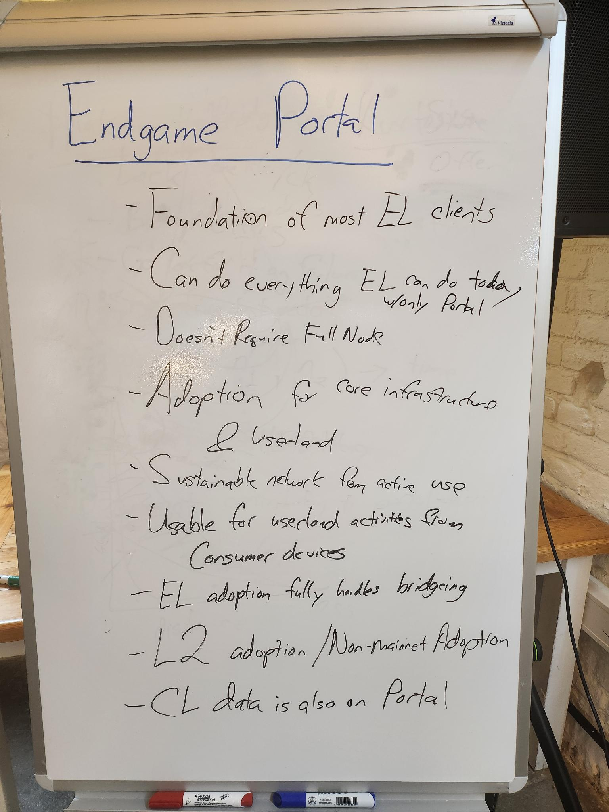
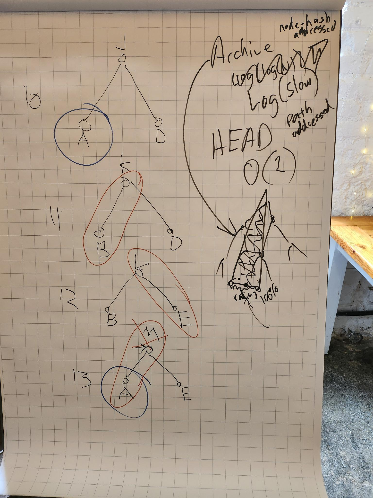
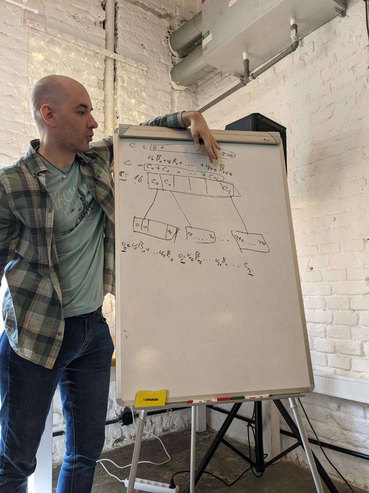
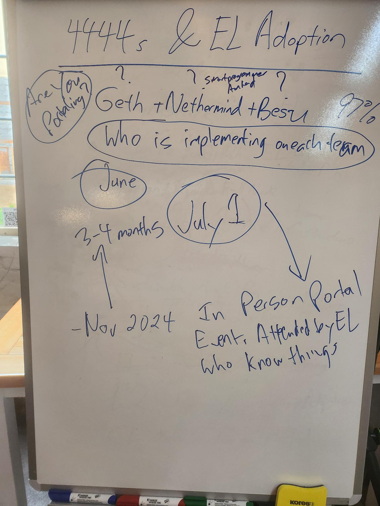
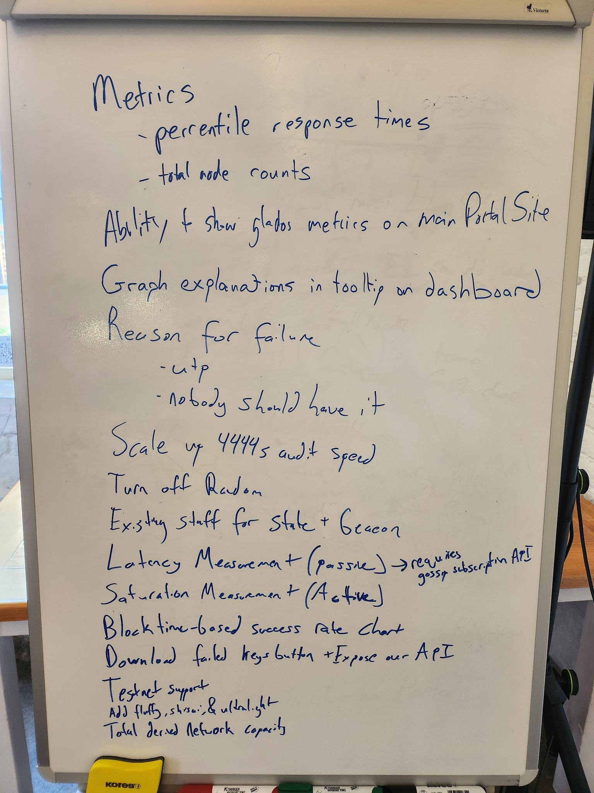

I am sitting here on the third and last day of our summit event in Prague.  The
last two days have been full of deep discussions about the Portal protocol,
pouring over our designs and plans.  Much of our time has been focused on the
near term plans for finishing our MVP goals of delivering our three core
networks that are slated to deliver unprecedented access to Ethereum's
Execution data, free of long sync times and expensive hardware requirements.

- The Beacon network allows clients to follow the HEAD of the chain.
- The History network delivers access to the chain history, serving headers and block bodies
- The State network provides a full archive of Ethereum's account and contract state data

Since Ethereum's launch, this data has been locked away behind the high cost of
running an Ethereum full node.  The goal of Portal has always been to shift the
core paradigms of Ethereum's peer-to-peer distributed networks away from the
status quo of priviledged access to this data into an egalitarian model that is
inherently friendly towards broader participation and easier access.  

## Roadmap

One of the more important discussions we had this week was setting our roadmap
items for both the near term future as well as discussion the dependency chain
for our longer term plans.  In the short term, our focus remains to deliver the
core data needed by execution layer clients.

The Portal History network is largely feature complete.  The only remaining work is
centered around handling proofs for the most recent headers that are entering
the network as new blocks are added to the chain.  Our network requires chain
data to be canonically anchored, which requires proofs against the
`HistoricalSummaries` from the beacon state.  These proofs end up being mutable
during the roughly 27 hour period during which the latest batch of the
accumulator is still filling up.  Our teams are still deciding on a strategy
for how clients will handle these ephemerally proven headers at the tip of the
chain as they pass beyond the period boundary. One of our main take-aways for
our history network is ready for 4444s adoption and we consider the network as
a whole to be in "production" status.

The Portal Beacon network is also largely feature complete. The individual client
implementations are implementing logic to handle trusted beacon chain block
roots for bootstrapping into our beacon network. Recent work has been focused
around the proving paths that are needed from the beacon state and sourcing
this data for our beacon network bridges.  The beacon network is still in the
last stages of development and is expected to enter production over the next
1-2 months.

The Portal State network is under active development. We are on track for
delivering the initial phase of our state network by Devcon 2024, which will
support fetching arbitrary state data from tip of the chain. Both the Trin and
Ultralight clients have implemented state bridges in their client which can
start at the genesis state, execute the next block, extract the state diff, and
gossip all of the state data into the network. We have run some small
experiments to validate our designs and are now moving onto full
implementations in our clients.

All of this puts the Portal project on-track to deliver the production MVP of
our three initial networks by Devcon.

## State Network

Our primary focus here is delivery of our initial stage of the network which
implements full archival storage of all historical state in time for Devcon
2024. We spent most of our time focused on the development dependencies needed
to make this timeline a reality. Most of the work that is still to be done is
in our bridge infrastructure which is responsible for generating all fo the
trie data and gossiping it into our network. Our client teams have found that
supporting the actual content types for state network is relatively simple. Our
current plan is to initialize our network with a snapshot of the state taken
near the tip while in parallel we work forward from genesis to backfill all of
the historical state data.

Our biggest bottleneck for our state bridges is the rate at which data can be
gossip'd into the network.  Luckily, this is an area where there are lots of
easy and effective optimizations that simply need to be implemented.  This work
will be important in ensuring that our state bridges are both able to backfill
state from genesis at a reasonably fast rate as well as the more important
requirement that the state bridges can keep up with new state being generated
at the tip of the chain as each new block is mined.

We spent a very small amount of time discussing the second stage of the state
network, which will be focused on implementing a second storage model that is
focused on storing only the most recent state from the tip of the chain. This
alternative storage model is designed for faster access to state data and
depends on our initial stage plans for having archival state storage.

And lastly, we spent some time today discussing the proposed third stage for
our state network, which would implement a storage method similar to [Erigon's
reverse
diff](https://github.com/ledgerwatch/erigon/blob/main/docs/programmers_guide/db_walkthrough.MD)
based approach to archival storage.  This model would reduce the overall
storage requirements for the network and be a building block for more efficient
syncing of archival nodes.  This topic is still being actively researched.

## Verkle & Portal

Related to state data, we also spend some time discussing Verkle tries which
will change to how Ethereum stores state data. Milos Stankovic has been doing
research on how Portal can handle Verkle.  Luckily, most of our plans for how
to handle state in the current Merkle context apply directly to how it looks
like state will be handled under Verkle. There are still a few unsolved
problems surrounding how to efficiently implement archival storage under
Verkle.

## 4444s and Execution Clients

[EIP-4444](https://eips.ethereum.org/EIPS/eip-4444) was originally authored in
2021 and advocates for execution layer (EL) clients to drop chain history for
block that are sufficiently old.  Since then, the conversation has been largely
centered around the alternative data sources that are needed in order to ensure
that once clients drop this data that we can still reliably retrieve it.
Portal network has been aiming at serving as part of the 4444s solution, with
our history network being well suited for storing and serving individual block
data.

In the recent ACD interop event in Kenya the EL teams got together to discuss
finalizing 4444s plans and implementing the functionality in their individual
clients. During our event this week we discussed loose plans that we'll be
proposing to EL teams to provide them with support in integrating with the
Portal history network with the expressed goal of delivering 4444s this year.

## Glados

Glados is our network monitoring infrastructure. It provide visibility into the
current and historical status of our live networks. During the summit we
discussed future plans for more graphs and information we want from Glados and
new types of monitoring that we want to be possible.  Glados has continued to
be a key driver in our development process. It tells us important metrics about
our network as well as helping us identify problems as they occur.
