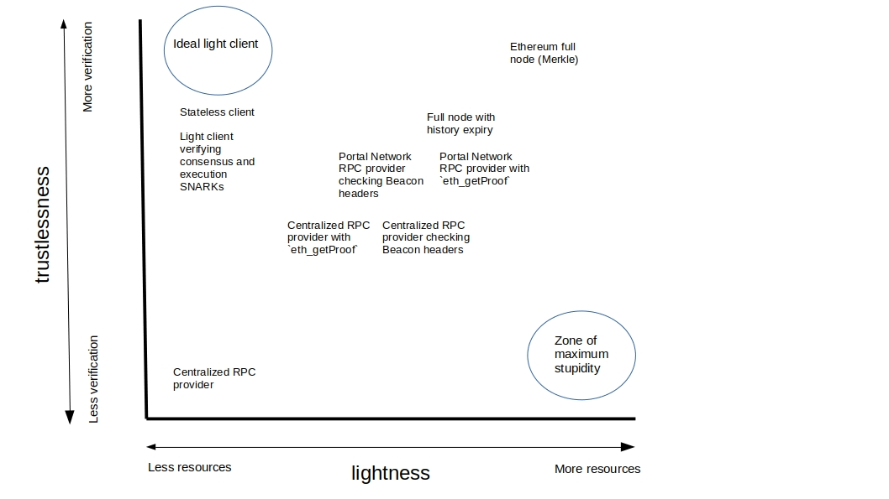

## Key Takeaways

- Light clients give access to Ethereum data to small devices, making it possible for apps, wallets, mobiles, bridges and IoT devices to interact with Ethereum. The associated trust assumptions depend upon the specific light client, ranging from completely trusting some RPC provider through to verifying both consensus and execution using SNARKs.
- Light consensus clients are currently easier to build than light execution clients because a dedicated light client protocol for consensus clients was launched at The Merge.
- The Portal Network enables users to get Beacon headers and `eth_getProof` responses from a peer-to-peer network, solving the problem of centralized third party RPC providers.
- The Portal Network also provides a decentralized storage network for historical data, enabling EIP 4444 (history expiry). This allows for lighter full nodes.
- Full nodes can be made lighter by expiring state data, but this requires multiple difficult protocol upgrades. (non inclusive list is Verkle tries, and address space expansion)
- Proof systems such as SNARKs are already being used to verify sync committees, but they will likely be used to verify execution, such as the state transition function.
- Further into the future, stateless clients will provide very lightweight access to Ethereum, but there are substantial prerequisites that must be shipped first, including Verkle tries.

## What is a light client?

A light client is a piece of software that provides access to Ethereum data without storing large amounts locally. This allows users to interact with Ethereum cheaply with minimal hardware requirements.

This very broad definition encompasses a spectrum of designs ranging from apps that request data from an RPC provider and forward it to the user unchecked, right through to clients that verify proofs demonstrating that incoming data was both correctly computed and attested by a supermajority of Ethereum validators. 

Many would not consider the “unchecked RPC forwarding app” to be a light client. Typically, people understand “light client” to include some form of verification. 

The design space for how light clients verify incoming information is fairly large, and can include:

- Verifying signatures to prove that a certain sync committee signed off a given block header
- Verifying a SNARK that demonstrates that a certain sync committee signed off a given block header
- Verifying some specific data against the Ethereum state trie using a `eth_getProof` request to an RPC provider.
- Making multiple identical RPC requests to different providers and accepting data that replicates at least N/M times.
- Verifying a SNARK over the state transition function to demonstrate that blocks were correctly processed.

There is also a spectrum of lightness. At the light end of the spectrum is the non-verifying RPC response-forwarding app. This can be extremely light because it’s essentially just an HTTP client. At the other end of the spectrum is a full node which is not at all light - it requires several TB of storage and substantial bandwidth and CPU to allow it to independently execute incoming transactions and verify their validity. Everything else is spread across a continuum between these two end-members. 

In summary, “light client” can mean many things to many people. There are many designs out there for making clients lighter, each with their own individual trade-offs. 

***The ideal light client uses the minimum amount of computing resources to do the maximum amount of independent verification.***

### Light is right?

"Light is right" is a famous adage in Alpine climbing intended to encourage climbers to minimize the amount of weight they carry with them on challenging climbs. It's common to see alpinists sawing and sanding any extraneous material off their hardware, and leaving the ground with only the absolute barest minimum of equipment weighing them down. However, the trade-off is very small room for error and greater risk exposure. The analogy extends to Ethereum nodes: is light right?

Users *are* weighed down by storage and compute requirements, but those requirements are also risk reducers. The more independent verification your client can do, the less vulnerable you are to being tricked into following an incorrect chain or accepting some incorrect data. 

Today, this comes at a cost because true independent verification means re-executing transactions locally and maintaining a local copy of the blockchain. The more you strip away local storage and compute, the more you rely on some form of remote data that you do not control. 

Light clients aim to maximally reduce the local resources a user has to allocate while minimally degrading the confidence a user has in the correctness of their Ethereum data.

The benefit light clients bring is the ability for users to access Ethereum data with minimal resource allocation. This benefit is conferred by *all* light clients whether they do any data verification or not.

Light clients that *verify incoming data* provide some additional benefits: 

- they allow the user to check that the data they received from an RPC provider is genuinely part of the recent canonical Ethereum chain
- second, an emergent effect of the proliferation of *verifying* light clients is greater overall network security because a greater number and wider distribution of independent devices are tracking the tip of the canonical chain.

It’s also important to realize that in many cases the choice is not between light node and full node. There is a sizeable subset (maybe a majority) of users who are more likely to walk away from Ethereum than they are to run a full node. For those users, any form of light client verification is a strict improvement over blindly trusting third party data or not using Ethereum at all. 

The ability to embed light client verification into apps and devices provides some additional protection to these users without requiring them to sacrifice the convenience of trusted third party data providers. 

These users are interesting because we can assume the centralized RPC provider experience is their happy baseline, and that they are highly sensitive to changes in resource allocation and convenience. The challenge for light client developers is to devise ways to make these users as safe as possible without changing their user experience.

### The lightness legacy

The history of Ethereum light clients starts with LES (light execution subprotocol). LES was a sub-protocol implemented in the Geth client that allowed nodes to request their data from full nodes rather than storing full-node data for themselves. LES was widely known but turned out not to be the right model for widespread light client adoption. The reason was that the light client was reliant upon altruistic Ethereum full-nodes opting in to serving light client data. 

Those altruistic full nodes were relatively scarce, meaning they had to allocate substantial additional bandwidth to serve all the light clients requesting their data. This was a self-reinforcing trend as the greater the load on light serving full nodes, the less likely they were to opt-in to serving it, further increasing the load on the remaining servers. 

LES was finally broken by The Merge and has not been revived for proof-of-stake Ethereum, although the Geth team have been exploring new models for lightweight access to Ethereum.

Read [Peter's reflections on LES](https://gist.github.com/karalabe/184125637d587a16fe038f99a6daefea)

Read [Piper’s reflections on building light clients](https://blog.ethportal.net/posts/winding-road1)

As researchers developed the consensus client specifications in advance of The Merge, they included dedicated infrastructure allow consensus clients to easily serve light client updates, and to do it by default, rather than requiring explicit opt-in. This has made developing *consensus* light clients far easier than execution light clients.

The consensus light client protocol serves block headers signed off by a sync committee of 512 randomly selected validators. A light client checks that the sync committee signature is valid and that enough validators signed. Assuming these checks pass, the light client accepts the block header. Doing this enables the light client to keep track of the head of the canonical chain. The header contains a state root that can then be used to verify Merkle proofs for state data.

A client consuming light client data can be used as a light-weight alternative to a full Beacon node, offering sync-in-seconds, low bandwidth and <1MB storage requirement with the trade-off being a ~15 second lag behind the head of the chain, and some trust assumption since full chain validation is delegated to full nodes. 

The Beacon light client protocol only provides lightweight access to summary consensus data, such as the latest finalized header. It is still necessary to have access to a full node to use the Ethereum JSON-RPC API or to independently verify the chain. 

### What can we do with consensus light clients?

Consensus light clients are those that follow the tip of the chain using the Beacon light client sync protocol. There are also clients, such as Helios and Succinct, that are working on achieving the same by verifying SNARKs over the sync protocol rather then verifyign the sync committee signatures - more on this later.

Consensus light clients are useful for three main reasons:

- they provide certainty that you are following the head of the canonical chain
- they allow you to independently verify Ethereum data obtained from some RPC provider, assuming that provider exposes `eth_getProof`
- they provide lightweight ways to accelerate execution client syncing and helping them to follow the canonical chain.

### rpc-verifiers

The most basic class of use cases is the things Ethereum users can already do, but with smaller trust or hardware requirements. An example is a portfolio app, or a wallet that shows account balances. Today, a common pattern is that users see their balances because a centralized provider queries their full node to retrieve a user's balance from their local copy of Ethereum's state data.

The user is then required to trust that the centralized provider is showing the right data and isn't doing anything nefarious in the background. Users with their own node can bypass this trust requirement but at the cost of allocating substantial resources to running the node. 

A consensus light client gives the user access to a recent block header that is known to come from the canonical chain, where “known” means the light client has independently checked that the header was signed off by a sufficient number of Ethereum validators and that their signatures are correct. The block header includes a state root - a unique string of characters generated by hashing all the information in successive levels of Ethereum’s state trie. 

By requesting a proof for some specific piece of data, an app can compare the path from data to state root in the proof with the state root in the block header. If the two roots match, then the app can be confident they are being shown real Ethereum data, rather than blindly trusting the data provider.

Note, however, that not all of the popular RPC providers expose the `eth_getProof` method. This means that if your data only comes from those providers you have to blindly trust even if you have a light client available.

[Kevlar](https://github.com/lightclients/kevlar) is an example of a CLI app that uses a light client to provide an RPC proxy that verifies data being presented by your browser wallet against the state root from the latest Beacon header.

***"Don't trust, verify" is made possible for the next billion by light clients.***

### Sync accelerators

The consensus light client can also be used to enhance full node syncing, since it can verify that a recent block hash definitely has some weak subjectivity checkpoint (e.g. the merge transition block) as an ancestor, and can be used as a lightweight patch for execution clients that can no longer run standalone since The Merge without having to run a full Beacon node. This provides a non-negligible reduction in the resources required to run a full node, although you are trading off fully independent Beacon chain verification. 

### Use cases

There are a whole class of new applications that can exist thanks to consensus light clients because Ethereum can run on small devices with minimal storage, memory and processing power.

**Embedded light clients**

Wallets with embedded light clients that can independently verify the data they receive using the combination of the header verification and `eth_getProof` which can be executed easily in the browser or on mobile phones, for example, or even smaller devices such as smart watches. This expands access to Ethereum data without increasing the requirement to blindly trust data coming from third parties. 

**IoT**

An extension of running light clients on small devices is the ability to embed Ethereum nodes into IoT (Internet of Things) devices. This is how applications such as NFT ticketing, become reality, since a light client could be used to rapidly verify ownership of specific digital assets and trigger some action in an IoT device/network. Applications such as NFT-powered bicycle rental, event ticketing, building access, etc have been anticipated. 

**Games**

On-chain games and simulated worlds may well also need to rapidly verify the validity of some given balance or transaction history without wanting to run Ethereum full nodes.

**Bridges**

Light clients can become an important part of layer 2 rollup infrastructure that can reduce the frequency of bridge hacks. Bridges are famously the weak link between layer-1 Ethereum and the set of rollups settling to it. A light client embedded inside a bridge contract could be used to protect against corrupted oracles on either side of the bridge because deposits can come with proofs that can be verified before any tokens are released. In a general sense, the ability to embed light clients makes the application landscape more secure.

***There are also sure to be use-cases we can't imagine today**.*

### Limitations

However, there is a lot that consensus light clients cannot do. Execution clients are still required to expose the JSON-RPC API, run the EVM and handle Ethereum state, history and receipt data. 

This is where most of the weight of an Ethereum client is, because local copies of substantial amounts of blockchain data are what enable execution clients to verify data rapidly (there is no network latency slowing down data retrievals) and independently (the node has its own sovereign copy of the canonical chain that can't be spoofed). 

Going light has traditionally meant outsourcing storage of the chain data to a third party and requesting it as needed, which erodes both the speed and trust benefits of local data. A consensus light client allows you to verify that incoming data, but that doesn't mean they aren't also harvesting your data and maybe doing something nefarious with it and it doesn't prevent them from censoring your transactions. 

It is also *possible* that a sync committee has been convinced to sign off some invalid data. A consensus light client alone could not protect against that - they trust whatever the sync committee has signed off. The only way to prevent this is to verify execution as well as consensus.

## Execution light clients

Because Ethereum's state growth is unbounded, light execution clients have to be built with methods that can verify blocks and transactions without relying on querying local data. There are three broad classes of ways to achieve this:

- rely on some remote data store
- keep a small amount of recent data and delete the rest
- go stateless

### Relying on remote data

The first option, relying on some remote data store, is effectively what people do today when they request data from an RPC provider. The RPC call is routed to someone else's node and you trust they provide you with correct data and do not do anything else nefarious, such as tracking you, selling your information, censoring certain actions, etc. 

Ideally, there would be some way to combine the convenience and lightness of relying on a third party RPC provider with the trustlessness and privacy of running a full node. The closest thing we have to this is the Portal Network.

Portal Network is a way to share Ethereum data peer-to-peer. Each Portal node stores a small chunk of Ethereum data in a distributed hash table. When you request some specific piece of data, the request propagates across the network until it reaches a node that happens to have a copy of the data your are looking for. Then, that peer sends it directly to you over the wire without any intermediary. 

The Portal nodes have their own stack of cryptographic checks and balances to ensure that the data they store is from the canonical Ethereum chain. As a user you have several options for interacting with Portal: 

- you can send RPC requests to a remote Portal client that then forwards that request to the peer-to-peer network and returns the response to you. Portal clients (will) support `eth_getProof` so you can verify the data you receive against state roots from your consensus light client.
- you can run your own Portal client (Trin, Ultralight or Fluffy). This requires more technical know-how and resource allocation than interacting witha  remote Portal client, but far less than running a full Ethereum node. In this case, you can get both your execution and consensus data from Portal, trusting the node’s built-in verification for assurance that your data is valid and from the canonical chain.
- you can run an Ethereum execution client that implements the Portal Network protocol. In this case, your normal Ethereum node could be made dramatically less resource intensive by grabbing execution data from the Portal Network rather than from its own local copy of the blockchain. There may be hybrid options where a full node fully processes the block(s) closests to the tip of the chain and relies of Portal to provide data more than X blocks behind the head. Note that to our knowledge no-one has done this yet!

The Portal Network approach offers two major benefits to Ethereum users:

- it removes the need for light clients to interact with centralized third party RPC providers
- it allows execution clients to prune their local data safe in the knowledge that it is stored with redundancy on a decentralized network with high availability

### Deleting unnecessary data

The quest for lightweight access to Ethereum typically focuses on creating new kinds of clients. However, the alternative path is to make the existing Ethereum client software less dependent on local copies of large chunks of blockchain data. One way to do this is to allow historical data to "expire" and be deleted from client's databases. The rationale is that execution clients rarely need old data, so there's no need to allocate a lot of resources to it.

The problem is that *someone* still needs to store the data, and we don't want to have to trust that person to be truthful, and we don't want to be vulnerable to that person going offline. There are several solutions: one is to rely on altruistic actors and hoping that they are sufficiently numerous and geographically and technically decentralized as possible. Another option is to rely on the apps and institutions that *need* the data routinely to host it and also make it available to other network participants. This might be indexers, exchanges, portfolio trackers etc. 

Arguably the best solution is, again, the Portal network. The Portal Network provides a decentralized way to store historical data without relying on centralized actors, and also without requiring each data-server to allocate large resources to the task.

### Statelessness

The other option is to make state databases redundant for the average node operator. This is known as statelessness. The flavour of statelessness favoured by Ethereum researchers today (”weak statelessness”) does not eliminate the need for state databases for everyone, but it shifts responsibility for state storage onto block proposers and away from all other nodes on the network. 

The core idea of statelessness is that block proposers generate witnesses (small proofs that verify all the state changes included in a block). All non-block-proposing nodes need is the state hash in order to verify the changes proposed in each block. All the necessary information for verification is included *in each block*. This removes the need for nodes to store past blockchain data. Eventually only block producers need to handle state data, everyone else on the network can verify blocks using *information contained in the block being verified* only. This allows Ethereum full nodes to become extremely light, but the trade-off is centralization of block production. The arguments in favour of this are:

- it allows *most* users to fully verify each new block with very small resource requirements
- block production is centralizing around a few advanced operators anyway due to competition for MEV
- it is extremely difficult for centralized block producers to act dishonestly when the majority of consumers are fully verifying each block

There are also proof-based models for light clients short of a fully stateless Ethereum. Instead of trusting light client updates emitted by full nodes, a light client could receive updates in the form of a summary of changes and a proof. The proof can be verified and the light client can apply the updates without having to re-execute transactions. Confirming that the Ethereum protocol rules were followed is a process of quickly and cheaply verifying the proof instead of re-executing the transactions and/or checking signatures.

There are already [light clients that verify SNARKs](https://blog.succinct.xyz/introducing-telepathy/) (a type of cryptographic proof) over the sync committee protocol, which can be done more cheaply than verifying the signatures themselves. A light client can verify the proof and accept the new block header, confident that it was signed off by the correct sync committee. The proof verification is extremely fast, usually taking tens of milliseconds. It is much faster to verify a computation than to actually perform one. 

A similar process could also be used to verify state transitions, which would allow light execution clients to verify the validity of the transactions in a block without actually having to execute them. The light client would receive a set of *changes* the were applied between one block and the next and a pair of Merkle proofs for each change (proving the pre-state and the post-state data). This data forms the *witness*. A proof can then be constructed that is much smaller than the witness itself, that demonstrates that the witness, processed according to the Ethereum protocol rules, really geenrates the given post-state. The light client only has to verify the proof to be able to confidently accept the post-state, rather than having to confirm by re-executing transactions as today’s full nodes do.

An extremely lightweight node could be created that only verifies proofs representing the sync committee protocol and state transition function, enablign both consensus and execution to be verified without the need for lots of local storage and transaction execution.

So where's the trade-off? The trade-off is that although verifying a proof is very cheap, *generating* the proof is very expensive. Where verifying a proof may take tens of milliseconds, generating it may take tens of minutes. This is the responsibility of the block-producing full node, adding substantially to an already fairly heavy workload for those nodes. It might eventually require specialized hardware such as GPU arrays or FGPAs. Increasing hardware requirements is generally considered to be a centralizing force.

### Where are we today?

The light clients that exist today are primarily consensus light clients that get their data from RPC requests to a full node and verify against state roots embedded in Beacon block headers. Typically the light client verifies the sync committee signatures, but some newer clients verify SNARKs over the sync committee protocol instead, achieving the same thing but with less computation. Either way, these consensus clients require access to execution data to do anything more interesting than tracking the tip of the chain.

Getting this execution data requires trusting a third party RPC provider to provide honest data without censoring or doing anything nefarious with your information. Some RPC providers expose `eth_getProof` so that you can independently verify the data they provide against a state root from a trusted block header, but some don’t. 

The table below shows which RPC methods are exposed by each of three clients representing a full (execution + Beacon) client, two light clients ([Lodestar’s light client rpc-prover app](https://chainsafe.github.io/lodestar/lightclient-prover/prover/) and [Helios](https://github.com/a16z/helios/blob/master/rpc.md)) and a Portal client (could be Trin, Fluffy or Ultralight - they aim for feature parity). 

The shortest path to decentralized light clients is swapping out centralized RPC endpoints for a decentralized alternative. The Portal Network is the solution for this, as it provides consensus and execution data on a peer-to-peer network. However, the Portal Network is not fully operational yet. 

The Portal History network will be the first to be fully available. This is expected to happen in the first half of 2024. As soon as this happens, Ethereum client teams could ship EIP 4444 (history expiry) and dramatically lighten Ethereum full nodes. The Portal History network allows historical data to be distributed across all the Portal nodes, with redundancy, so that it can still easily be requested by full nodes when it is needed, but without any specific node having to allocate large amounts of storage.

The History sub-protocol alone is not sufficient for serving a new generation of light clients. For this, there has to be a way for the Portal Network to serve the RPC endpoints that touch Ethereum’s state, such as `eth_getProof` as well as providing a decentralized source of Beacon block headers that contain the latest state root.  This requires the Portal State and Portal Beacon networks to be fully featured and populated with state data. This is also expected to happen in 2024.

While there are [SNARK based consensus clients](https://blog.succinct.xyz/introducing-telepathy/), SNARK-based execution light clients don’t *seem* likely to be production ready until at least 2025, based on the fact that most development seems to be happening on proof-of-concepts and there are some infrastructural developments that need to happen to support such a system - like dedicated provers coming online. Similarly, stateless Ethereum has been thoroughly researched but launching on Mainnet might prove to be somewhat contentious and is anyway blocked on some substantial prerequisite upgrades including Verkle tries and enshrined proposer-builder separation. 

Moving to stateless Ethereum clients requires some entitiies to come online with enough technical know-how and hardware resources to act as provers, and to gossip proofs fairly across the network of Ethereum nodes now acting as verifiers. It seems plausible that the Portal Network could be a viable solution here too, with provers piping their data into a dedicated Portal sub-protocol that handles the distribution of proofs to verifying nodes.

**Portal Network:** **What's the catch?**

Throughout this article, Portal Network has been emerged as the leading solution to many of the headwinds facing light clients today; however, it is important to realize that Portal Network has its own set of tradeoffs.

Grabbing data from Portal Network is slow compared to looking it up from a local database because there is network latency to account for. This can be problematic for use cases that rely on fast execution, such as MEV bots and other high-frequency operations that rely on rapid access to the tip of the chain. There is still some reliance on altruistic network participants contributing substantial resources to keeping the Portal network alive, since bridge nodes are required to pipe data from the Ethereum network into the Portal Network. The bridges are currently one-way, so there's no way to send transactions to Ethereum using Portal infrastructure alone, although there are plans to build a public Portal transaction pool that bridges back to the Ethereum gossip network in the future.

### Outlook

Light clients are finally on their way, but there are still some headwinds to overcome. The first major unlock will be the Portal Network having fully featured and data-rich history, state and beacon subnetworks, as this will enable decentralized RPC access to all the data light clients need to verify proofs and track the head of the canonical chain, while full nodes will be able to prune their historical data confident that the necessary information is archived on the Portal Network. 

While proof-based light clients and stateless Ethereum are still quite a way off, 2024 is shaping up to be a pivotal year for light clients, largely because of the Portal Network sub-protocols coming online and supporting decentralized access to consensus and execution data. Once this happens, it should be a small task to upgrade light clients by swapping out their RPC provider for a Portal client. It is expected that some Ethereum client teams will start to integrate the Portal Network specification into their clients directly rather than running parallel Portal clients. 

In summary, some exciting things to watch out for in the light client space in 2024 are:

- Portal Network shipping the History sub-protocol, enabling history expiry in Ethereum clients
- Portal Network shipping the Beacon sub-protocol, enabling decentralized access to the latest canonical block headers for light clients
- Portal Network shipping the State sub-protocol, enabling decentralized access to Ethereum state data, including `eth_getProof`.
- Ethereum client teams implementing the Portal specification directly into Ethereum clients, making it easier to access Portal data.
- Ethereum researchers and client developers advancing Verkle tries and ePBS

## Further Reading and references

[Helios light client](https://github.com/a16z/helios)

[Lodestar light client](https://github.com/ChainSafe/lodestar/tree/unstable/packages/light-client)

[Portal Network specs](https://github.com/ethereum/portal-network-specs)

[a16z intro to light clients](https://a16zcrypto.com/posts/article/an-introduction-to-light-clients/#section--1)

[ZK jargon decoder](https://nmohnblatt.github.io/zk-jargon-decoder/definitions/snark.html)

[Ethereum.org page on light clients](https://ethereum.org/en/developers/docs/nodes-and-clients/light-clients/#current-state-of-development)

[Piper’s Devconnect talk on light clients and Portal Network](https://app.streameth.org/devconnect/light_client_summit/session/the_ongoing_pilgrimage_to_lightweight_access_to_the_ethereum_protocol)

[Roman Dvorkin’s Devconnect talk on light nodes](https://app.streameth.org/devconnect/light_client_summit/session/remote_presenter_building_a_trustless_lightclient_assistant_in_your_browser)

[Succint's Telepathy SNARK-based consensus light client](https://blog.succinct.xyz/introducing-telepathy/)
