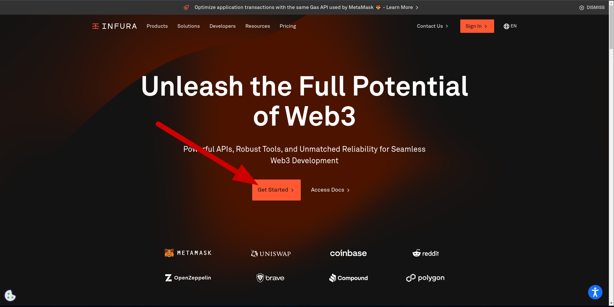
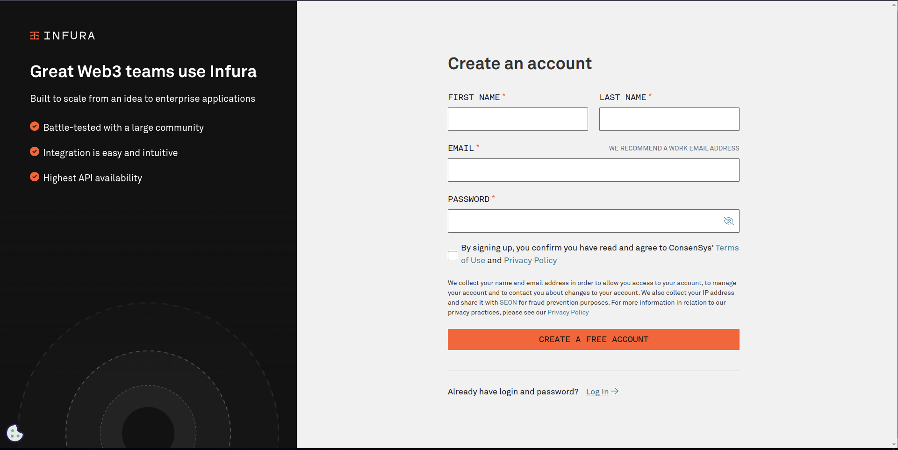
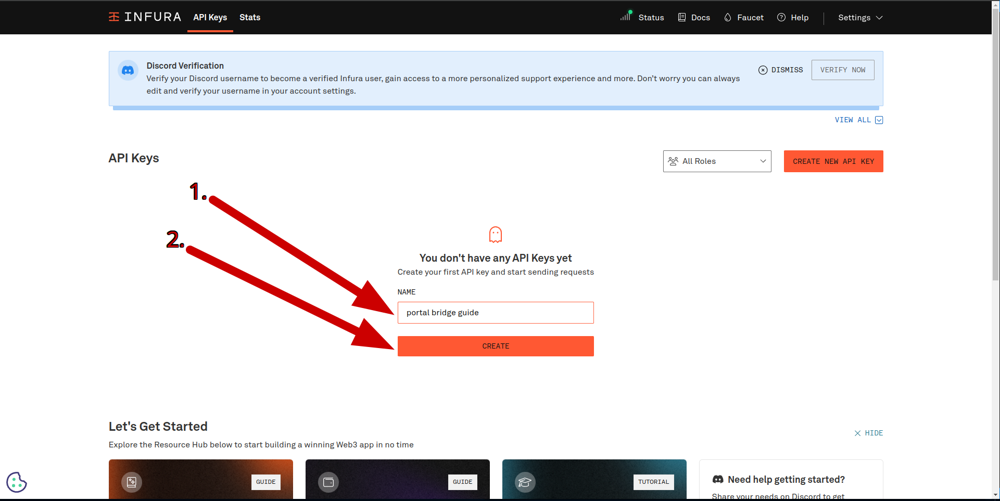
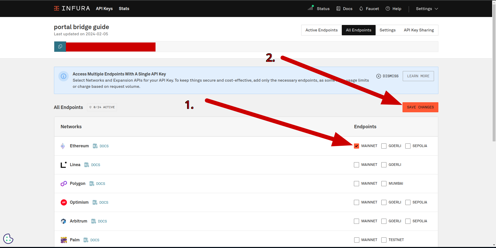
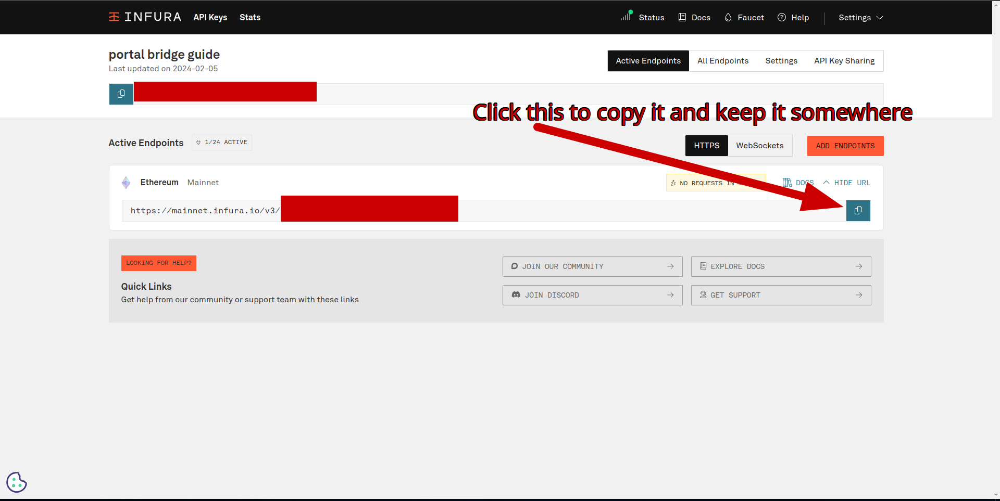

# What is a Portal Bridge?
A Portal Bridge is an application which takes Ethereum mainnet data from a source and provides it to a Portal client to inject into Portal sub-networks.

# What are we doing in this guide?
We will be deploying a Portal Bridge using the free tier of Infura. The bridge will be running in "latest" mode for the History network, injecting the latest Ethereum block data into the History network layer of the Portal network. The Portal History network is a Portal sub-network which stores canonical Ethereum mainnet headers, block bodies, and receipts.

# Guide
<details><summary>Step 1: Get Infura API key url</summary>

**Step 1:** goto https://www.infura.io/ and click get started

**Step 2:** Create an account or login

**Step 3:** Create an API key

**Step 4:** Click mainnet then save changes

**Step 5:** Copy the Infura endpoint and save it for later

</details>
<details><summary>Step 2: If using Windows follow this to install build dependencies</summary>

**Step 1:** open powershell

**Note** only install these if you don't have them already

**Step 2:** Install Rust `winget install Rustlang.Rustup`

**Step 3:** Install git `winget install -e --id Git.Git`

**Step 4:** Install clang/llvm as it is required to compile c-kzg `winget install LLVM.LLVM`

**Step 5:** Install Microsoft C++ Build tools https://visualstudio.microsoft.com/visual-cpp-build-tools/ make sure to check `Desktop development with C++` before clicking the install button

**Step 6:** open a new powershell to refresh environment variables

</details>
<details><summary>Step 2: If using Ubuntu/Linux follow this to install build dependencies</summary>

**Step 1:** Open the terminal

**Step 2:** Install system dependency's required

  ```sudo apt install libclang-dev pkg-config build-essential git```

**Step 3:**  Install Rust https://www.rust-lang.org/tools/install
</details>

</details>
<details><summary>Step 3: Run the bridge!</summary>

**Step 1:** Clone trin project: ``git clone https://github.com/ethereum/trin.git``

**Step 2:** cd into trin: `cd trin`

**Step 3:** compile trin `cargo build --bin trin`

**Step 4:** clone portal-accumulators `git clone https://github.com/ethereum/portal-accumulators.git`

**Step 5:** run the bridge (make sure to `<put infura url/(api key) here>` with your Infura api key url you got earlier) `cargo run -p portal-bridge -- --executable-path ./target/debug/trin --mode latest --el-provider <put infura url with api key here> --epoch-accumulator-path ./portal-accumulators trin`

</details>

**Tada** you are now providing the Portal Network with very valuable data! You should see a stream of logs indicating that your bridge is finding new headers from the provider and serving them to the network.
